# Base de données WH_OR_GROUPE_CAA — Documentation complète

**Plateforme :** Microsoft Fabric Data Warehouse
**Serveur :** `eujjqvl7et3e7bty4hx3e7ithy-2yuxrr44y2aevad5c5wx4megk4.datawarehouse.fabric.microsoft.com`
**Schéma :** `dbo`
**Nombre de tables métier :** 34
**Note :** Aucune clé étrangère formelle (FK) n'est définie. Les relations sont **implicites** via des colonnes `Id*` et `Code *`.

---

## Table des matières

1. [Vue d'ensemble et volumétrie](#1-vue-densemble-et-volumétrie)
2. [Schéma relationnel (relations implicites)](#2-schéma-relationnel-relations-implicites)
3. [Diagramme des relations (Mermaid)](#3-diagramme-des-relations-mermaid)
4. [Détail de chaque table](#4-détail-de-chaque-table)
5. [Glossaire des colonnes récurrentes](#5-glossaire-des-colonnes-récurrentes)

---

## 1. Vue d'ensemble et volumétrie

| Table | Nb lignes | Description |
|-------|----------:|-------------|
| Activité | 0 | Référentiel des activités (codes activité) |
| Affaire | 490 | Dossiers / affaires commerciales |
| Article | 15 450 | Référentiel des articles (produits, services) |
| Calendrier | 7 645 | Table de dimension calendrier (dates, mois, trimestres...) |
| Client | 4 668 | Référentiel des clients |
| Commande client | 4 987 | En-têtes de commandes clients (table pivot, 1 seule colonne Id) |
| Commande client analyse | 0 | Analyse agrégée des commandes clients (coûts, ventes, temps) |
| Commande client analyse devis gestion | 0 | Ventilation des coûts/montants devis par poste de gestion sur commande |
| Commande client ligne | 43 471 | Lignes de détail des commandes clients |
| Commande fournisseur | 16 913 | En-têtes de commandes fournisseurs |
| Commande fournisseur ligne | 97 017 | Lignes de détail des commandes fournisseurs |
| Commercial | 695 | Référentiel des commerciaux (salariés à rôle commercial) |
| Devis client | 18 997 | En-têtes de devis clients (table pivot, 1 seule colonne Id) |
| Devis client gestion | 0 | Ventilation des coûts/montants par poste de gestion sur devis |
| Devis client ligne | 189 450 | Lignes de détail des devis clients |
| Dépense frais | 12 354 | Dépenses de frais imputées aux commandes/OF |
| Dépense temps passé | 215 697 | Temps passé par les salariés sur commandes/OF |
| Dépôt | 7 | Référentiel des dépôts (lieux de stockage) |
| Entreprise | 8 | Référentiel des entreprises / filiales du groupe |
| Facture client | 0 | En-têtes de factures clients |
| Facture client ligne | 112 574 | Lignes de détail des factures clients |
| Facture fournisseur | 0 | En-têtes de factures fournisseurs |
| Facture fournisseur ligne | 39 972 | Lignes de détail des factures fournisseurs |
| Fournisseur | 2 863 | Référentiel des fournisseurs |
| Groupe client | 134 | Groupes / regroupements de clients |
| JoursFiliale | 28 | Jours et horaires par filiale |
| Matériel | 0 | Référentiel du matériel (équipements, machines) |
| Poste gestion | 187 | Référentiel des postes de gestion (catégories de coûts) |
| Responsable | 695 | Référentiel des responsables (salariés à rôle responsable) |
| Salarié | 695 | Référentiel des salariés |
| Secteur activité | 229 | Référentiel des secteurs d'activité |
| Societes_Param | 4 | Paramètres par société |
| Technicien | 695 | Référentiel des techniciens (salariés à rôle technique) |
| Temps | 9 132 | Table de dimension temps (dates, semaines, semestres...) |

> **Note :** Les tables `Commande client`, `Devis client`, `Facture client` et `Facture fournisseur` ont 0 lignes dans les en-têtes mais des lignes de détail. Les données d'en-tête sont probablement intégrées dans les tables `*ligne` ou `*analyse`.

---

## 2. Schéma relationnel (relations implicites)

Il n'y a **aucune contrainte de clé étrangère** formelle dans cette base (typique d'un Data Warehouse Fabric). Les relations sont déduites des noms de colonnes `Id*` présentes dans les tables.

### Tables de référence (dimensions)

| Table dimension | Clé (colonne Id) | Utilisée par |
|----------------|-------------------|--------------|
| **Entreprise** | `IdEntreprise` | Commande client analyse, Commande client analyse devis gestion, Commande client ligne, Commande fournisseur, Commande fournisseur ligne, Devis client gestion, Devis client ligne, Dépense frais, Dépense temps passé, Facture client, Facture client ligne, Facture fournisseur, Facture fournisseur ligne |
| **Client** | `IdClient` | Commande client analyse, Commande client ligne, Devis client ligne, Facture client, Facture client ligne |
| **Groupe client** | `IdGroupeclient` | Commande client analyse, Commande client ligne, Devis client ligne, Facture client, Facture client ligne |
| **Fournisseur** | `IdFournisseur` | Commande fournisseur, Commande fournisseur ligne, Facture fournisseur, Facture fournisseur ligne |
| **Affaire** | `IdAffaire` | Commande client analyse, Commande client ligne, Devis client ligne, Facture client, Facture client ligne |
| **Activité** | `IdActivité` | Commande client analyse, Commande client ligne, Commande fournisseur, Commande fournisseur ligne, Devis client ligne, Facture client, Facture client ligne, Facture fournisseur, Facture fournisseur ligne |
| **Secteur activité** | `IdSecteuractivité` | Commande client analyse, Commande client ligne, Commande fournisseur, Commande fournisseur ligne, Devis client ligne, Facture client, Facture client ligne, Facture fournisseur, Facture fournisseur ligne |
| **Article** | `IdArticle` | Commande client ligne, Commande fournisseur ligne, Devis client ligne, Dépense frais, Dépense temps passé, Facture client ligne, Facture fournisseur ligne |
| **Poste gestion** | `IdPostegestion` | Commande client ligne, Commande fournisseur ligne, Devis client ligne, Dépense frais, Dépense temps passé, Facture client ligne, Facture fournisseur ligne |
| **Salarié** | `IdSalarié` | Dépense frais, Dépense temps passé |
| **Commercial** | `IdCommercial` / `IdSalariéCommercial` | Commande client ligne, Devis client ligne, Facture client ligne |
| **Technicien** | `IdTechnicien` / `IdSalariéTechnicien` | Commande client ligne, Devis client ligne, Facture client ligne |
| **Responsable** | `IdResponsable` / `IdSalariéResponsable` | Commande client ligne |
| **Matériel** | `IdMatériel` | Dépense temps passé |
| **Dépôt** | `IdDépôt` | (référentiel, pas de lien direct trouvé) |
| **Commande client** | `IdCommandeClient` | Commande client ligne, Devis client ligne, Facture client ligne |
| **Devis client** | `IdDevisClient` / `IdDevis` | Commande client ligne |

### Relations entre tables de faits

| Table de fait | Liens vers |
|---------------|------------|
| **Commande client ligne** | Entreprise, Client, Groupe client, Affaire, Activité, Secteur activité, Article, Poste gestion, Commercial, Technicien, Responsable, Commande client, Devis client |
| **Commande client analyse** | Entreprise, Client, Groupe client, Affaire, Activité, Secteur activité |
| **Commande client analyse devis gestion** | Entreprise |
| **Devis client ligne** | Entreprise, Client, Groupe client, Affaire, Activité, Secteur activité, Article, Poste gestion, Commercial, Technicien, Commande client |
| **Commande fournisseur** | Entreprise, Fournisseur, Activité, Secteur activité, Salarié (acheteur) |
| **Commande fournisseur ligne** | Entreprise, Fournisseur, Activité, Secteur activité, Article, Poste gestion, Salarié (acheteur) |
| **Facture client** | Entreprise, Client, Groupe client, Affaire, Activité, Secteur activité |
| **Facture client ligne** | Entreprise, Client, Groupe client, Affaire, Activité, Secteur activité, Article, Poste gestion, Commercial, Technicien, Commande client |
| **Facture fournisseur** | Entreprise, Fournisseur, Activité, Secteur activité |
| **Facture fournisseur ligne** | Entreprise, Fournisseur, Activité, Secteur activité, Article, Poste gestion, Salarié (acheteur) |
| **Dépense frais** | Entreprise, Salarié, Article, Poste gestion |
| **Dépense temps passé** | Entreprise, Salarié, Article, Matériel, Poste gestion |

---

## 3. Diagramme des relations (Mermaid)

```mermaid
erDiagram
    Entreprise ||--o{ Affaire : "Code entreprise"
    Entreprise ||--o{ Client : "Code entreprise"
    Entreprise ||--o{ "Commande client ligne" : "IdEntreprise"
    Entreprise ||--o{ "Commande client analyse" : "IdEntreprise"
    Entreprise ||--o{ "Commande fournisseur" : "IdEntreprise"
    Entreprise ||--o{ "Commande fournisseur ligne" : "IdEntreprise"
    Entreprise ||--o{ "Devis client ligne" : "IdEntreprise"
    Entreprise ||--o{ "Facture client" : "IdEntreprise"
    Entreprise ||--o{ "Facture client ligne" : "IdEntreprise"
    Entreprise ||--o{ "Facture fournisseur" : "IdEntreprise"
    Entreprise ||--o{ "Facture fournisseur ligne" : "IdEntreprise"
    Entreprise ||--o{ "Dépense frais" : "IdEntreprise"
    Entreprise ||--o{ "Dépense temps passé" : "IdEntreprise"

    Client ||--o{ "Commande client ligne" : "IdClient"
    Client ||--o{ "Commande client analyse" : "IdClient"
    Client ||--o{ "Devis client ligne" : "IdClient"
    Client ||--o{ "Facture client" : "IdClient"
    Client ||--o{ "Facture client ligne" : "IdClient"
    Client }o--|| "Groupe client" : "Code groupe client"
    Client ||--o{ Affaire : "Code client"
    Client ||--o{ Matériel : "Code client"

    "Groupe client" ||--o{ "Commande client ligne" : "IdGroupeclient"
    "Groupe client" ||--o{ "Devis client ligne" : "IdGroupeclient"
    "Groupe client" ||--o{ "Facture client" : "IdGroupeclient"
    "Groupe client" ||--o{ "Facture client ligne" : "IdGroupeclient"

    Fournisseur ||--o{ "Commande fournisseur" : "IdFournisseur"
    Fournisseur ||--o{ "Commande fournisseur ligne" : "IdFournisseur"
    Fournisseur ||--o{ "Facture fournisseur" : "IdFournisseur"
    Fournisseur ||--o{ "Facture fournisseur ligne" : "IdFournisseur"

    Affaire ||--o{ "Commande client ligne" : "IdAffaire"
    Affaire ||--o{ "Commande client analyse" : "IdAffaire"
    Affaire ||--o{ "Devis client ligne" : "IdAffaire"
    Affaire ||--o{ "Facture client" : "IdAffaire"
    Affaire ||--o{ "Facture client ligne" : "IdAffaire"

    Activité ||--o{ "Commande client ligne" : "IdActivité"
    Activité ||--o{ "Commande fournisseur" : "IdActivité"
    Activité ||--o{ "Devis client ligne" : "IdActivité"
    Activité ||--o{ "Facture client" : "IdActivité"
    Activité ||--o{ "Facture fournisseur" : "IdActivité"

    "Secteur activité" ||--o{ "Commande client ligne" : "IdSecteuractivité"
    "Secteur activité" ||--o{ "Commande fournisseur" : "IdSecteuractivité"
    "Secteur activité" ||--o{ "Devis client ligne" : "IdSecteuractivité"
    "Secteur activité" ||--o{ "Facture client" : "IdSecteuractivité"
    "Secteur activité" ||--o{ "Facture fournisseur" : "IdSecteuractivité"

    Article ||--o{ "Commande client ligne" : "IdArticle"
    Article ||--o{ "Commande fournisseur ligne" : "IdArticle"
    Article ||--o{ "Devis client ligne" : "IdArticle"
    Article ||--o{ "Facture client ligne" : "IdArticle"
    Article ||--o{ "Facture fournisseur ligne" : "IdArticle"
    Article ||--o{ "Dépense frais" : "IdArticle"
    Article ||--o{ "Dépense temps passé" : "IdArticle"

    "Poste gestion" ||--o{ "Commande client ligne" : "IdPostegestion"
    "Poste gestion" ||--o{ "Commande fournisseur ligne" : "IdPostegestion"
    "Poste gestion" ||--o{ "Devis client ligne" : "IdPostegestion"
    "Poste gestion" ||--o{ "Facture client ligne" : "IdPostegestion"
    "Poste gestion" ||--o{ "Facture fournisseur ligne" : "IdPostegestion"
    "Poste gestion" ||--o{ "Dépense frais" : "IdPostegestion"
    "Poste gestion" ||--o{ "Dépense temps passé" : "IdPostegestion"

    Salarié ||--o{ "Dépense frais" : "IdSalarié"
    Salarié ||--o{ "Dépense temps passé" : "IdSalarié"

    Commercial ||--o{ "Commande client ligne" : "IdSalariéCommercial"
    Commercial ||--o{ "Devis client ligne" : "IdSalariéCommercial"
    Commercial ||--o{ "Facture client ligne" : "IdSalariéCommercial"

    Technicien ||--o{ "Commande client ligne" : "IdSalariéTechnicien"
    Technicien ||--o{ "Devis client ligne" : "IdSalariéTechnicien"
    Technicien ||--o{ "Facture client ligne" : "IdSalariéTechnicien"

    Responsable ||--o{ "Commande client ligne" : "IdSalariéResponsable"

    Matériel ||--o{ "Dépense temps passé" : "IdMatériel"

    "Commande client" ||--o{ "Commande client ligne" : "IdCommandeClient"
    "Commande client" ||--o{ "Facture client ligne" : "IdCommandeClient"
    "Commande client" ||--o{ "Devis client ligne" : "IdCommandeClient"

    "Devis client" ||--o{ "Commande client ligne" : "IdDevis"
```



---

## 4. Détail de chaque table

### 4.1 Activité (0 lignes)

Référentiel des codes activité pour le regroupement des opérations.

| Colonne | Type | Nullable | Rôle |
|---------|------|----------|------|
| Code activité | int | OUI | Code métier |
| Activité | varchar(255) | OUI | Libellé |
| **IdActivité** | **varchar(255)** | **NON** | **Identifiant unique (PK implicite)** |

---

### 4.2 Affaire (490 lignes)

Dossiers commerciaux / affaires suivies. Relie un client à un contexte commercial.

| Colonne | Type | Nullable | Rôle |
|---------|------|----------|------|
| Code affaire | varchar(255) | OUI | Code métier |
| Affaire | varchar(255) | OUI | Libellé |
| Code entreprise | int | OUI | FK → Entreprise |
| Code dossier | int | OUI | Numéro de dossier |
| Code client | varchar(255) | OUI | FK → Client |
| Date création | date | OUI | |
| Date modification | date | OUI | |
| Date affaire | date | OUI | |
| Date accord | date | OUI | |
| Date signature | date | OUI | |
| Date premier devis | date | OUI | |
| Code salarié commercial | varchar(255) | OUI | FK → Commercial |
| Code salarié technicien | varchar(255) | OUI | FK → Technicien |
| Code situation dossier | varchar(255) | OUI | |
| Situation dossier | varchar(255) | OUI | Libellé situation |
| Code priorité traitement | int | OUI | |
| Priorité traitement | varchar(255) | OUI | |
| Code origine | varchar(255) | OUI | |
| Origine | varchar(255) | OUI | |
| Code type | varchar(255) | OUI | |
| Type | varchar(255) | OUI | |
| Code produit | varchar(255) | OUI | |
| Produit | varchar(255) | OUI | |
| CA prévu | float | OUI | Chiffre d'affaires prévu |
| Taux de réussite | float | OUI | Probabilité de succès |
| Critère libre 1 à 40 | varchar(255) | OUI | Champs personnalisables |
| **IdAffaire** | **varchar(255)** | **NON** | **Identifiant unique (PK implicite)** |

---

### 4.3 Article (15 450 lignes)

Référentiel des articles : produits, pièces, services, matières premières.

| Colonne | Type | Nullable | Rôle |
|---------|------|----------|------|
| Code article | varchar(255) | OUI | Code métier |
| Article | varchar(255) | OUI | Désignation |
| Type article | varchar(255) | OUI | Catégorie d'article |
| Code famille 1 à 4 | varchar(255) | OUI | Codes familles de classification |
| Famille 1 à 4 | varchar(255) | OUI | Libellés familles |
| Code poste gestion achat | varchar(255) | OUI | FK → Poste gestion (achat) |
| Code poste gestion vente | varchar(255) | OUI | FK → Poste gestion (vente) |
| Mode lancement/réappro | varchar(255) | OUI | |
| Mode post-conso | varchar(255) | OUI | |
| Classement ABC | varchar(255) | OUI | Classification ABC stock |
| Délai d'appro | int | OUI | Délai d'approvisionnement (jours) |
| Quantité économique lot | float | OUI | |
| Est géré en stock | varchar(255) | OUI | |
| Mode réservation stock | varchar(255) | OUI | |
| Niveau stock sécurité | float | OUI | |
| Niveau stock alerte | float | OUI | |
| Niveau stock maxi | float | OUI | |
| Dernier prix achat | float | OUI | |
| Prix exploitation | float | OUI | |
| Unité exploitation | varchar(255) | OUI | |
| Date création | date | OUI | |
| Date modification | date | OUI | |
| **IdArticle** | **varchar(255)** | **NON** | **Identifiant unique (PK implicite)** |

---

### 4.4 Calendrier (7 645 lignes)

Table de dimension calendrier pour l'analyse temporelle.

| Colonne | Type | Nullable | Rôle |
|---------|------|----------|------|
| Date | date | OUI | Date du jour |
| Année | int | OUI | |
| Année exercice | int | OUI | |
| N° mois | varchar(2) | OUI | |
| N° mois exercice | int | OUI | |
| Mois | varchar(20) | OUI | Libellé mois |
| Mois exercice | varchar(20) | OUI | |
| Année - Mois | varchar(30) | OUI | |
| Période | varchar(6) | OUI | |
| N° jour/mois/trimestre/année relatif | int | OUI | Positions relatives |
| Jour/Mois/Trimestre/Année relatif | varchar(20) | OUI | Libellés relatifs |
| Jour | varchar(20) | OUI | Nom du jour |
| N° jour | int | OUI | |
| N° jour du mois | int | OUI | |
| Trimestre | varchar(20) | OUI | |
| Semaine | varchar(20) | OUI | |
| Est ouvrable | bit | OUI | |
| Est férié | bit | OUI | |
| Jour férié | varchar(30) | OUI | Nom du jour férié |
| Mois fiscal | varchar(20) | OUI | |
| N° mois fiscal | int | OUI | |
| Année fiscale | int | OUI | |

---

### 4.5 Client (4 668 lignes)

Référentiel complet des clients avec informations de contact et classification.

| Colonne | Type | Nullable | Rôle |
|---------|------|----------|------|
| Code client | varchar(255) | OUI | Code métier |
| Client | varchar(255) | OUI | Raison sociale |
| Code entreprise | int | OUI | FK → Entreprise |
| Code origine / Origine | varchar(255) | OUI | Source du client |
| Code groupe client | int | OUI | FK → Groupe client |
| Code NAF / NAF | varchar(255) | OUI | Activité INSEE |
| Code métier / Métier | varchar(255) | OUI | |
| Code profession / Profession | varchar(255) | OUI | |
| Code type client / Type client | varchar(255) | OUI | |
| Code zone commerciale / Zone commerciale | varchar(255) | OUI | |
| Code secteur géographique / Secteur géographique | varchar(255) | OUI | |
| Qualité | varchar(255) | OUI | |
| Est client | varchar(255) | OUI | Client actif ou prospect |
| Date création / Date modification | date | OUI | |
| Adresse 1, Adresse 2 | varchar(255) | OUI | |
| Code postal, Ville | varchar(255) | OUI | |
| Code département, Département, Région, Pays | varchar(255) | OUI | |
| Téléphone 1, Téléphone 2 | varchar(255) | OUI | |
| Code mailing / Mailing | varchar(255) | OUI | |
| EMail | varchar(255) | OUI | |
| Civilité | varchar(255) | OUI | |
| GPS latitude / GPS longitude | float | OUI | Géolocalisation |
| Critère libre 1 à 17 | varchar(255) | OUI | Champs personnalisables |
| **IdClient** | **varchar(255)** | **NON** | **Identifiant unique (PK implicite)** |

---

### 4.6 Commande client (4 987 lignes)

Table pivot des commandes clients. Contient uniquement l'identifiant.

| Colonne | Type | Nullable | Rôle |
|---------|------|----------|------|
| **IdCommandeClient** | **varchar(255)** | **OUI** | **Identifiant de commande** |

---

### 4.7 Commande client analyse (0 lignes)

Vue agrégée des commandes clients avec métriques financières (ventes, coûts, temps).

| Colonne | Type | Nullable | Rôle |
|---------|------|----------|------|
| Code commande | varchar(255) | OUI | Code métier |
| IdEntreprise | varchar(255) | NON | FK → Entreprise |
| Titre commande | varchar(255) | OUI | |
| Date commande | date | OUI | |
| IdClient | varchar(255) | NON | FK → Client |
| IdGroupeclient | varchar(255) | NON | FK → Groupe client |
| Code salarié responsable | varchar(255) | OUI | FK → Responsable |
| Code salarié commercial | varchar(255) | OUI | FK → Commercial |
| Code salarié technicien | varchar(255) | OUI | FK → Technicien |
| IdAffaire | varchar(255) | NON | FK → Affaire |
| IdActivité | varchar(255) | NON | FK → Activité |
| IdSecteuractivité | varchar(255) | NON | FK → Secteur activité |
| Code état avancement | varchar(255) | OUI | |
| Est commande interne | bit | OUI | |
| Montant vente commande | float | OUI | |
| Tps prévu commande | float | OUI | Temps prévu |
| Coût mo prévu commande | float | OUI | Coût main d'oeuvre prévu |
| Coût mo * coef 1 prévu commande | float | OUI | Coût MO pondéré |
| Coût achat prévu commande | float | OUI | |
| Coût achat * coef 1 prévu commande | float | OUI | |
| Montant vente / Coût revient / Temps devis | float | OUI | Métriques devis |
| Montant vente fabriqué / livré / facturé | float | OUI | Suivi avancement |
| Temps réalisé | float | OUI | |
| Coût mo réalisé / Coût achat réalisé | float | OUI | Coûts réels |
| Coût achat engagé | float | OUI | |
| Coût frais réalisé | float | OUI | |

---

### 4.8 Commande client analyse devis gestion (0 lignes)

Ventilation des montants devis par **poste de gestion** (AMB, AMP, BUF, CHA, CHT, COF, COM, ELF, ...) sur les commandes clients. Chaque poste de gestion a 3 colonnes : `Coût revient`, `Montant`, `Quantité` (+ variante `Coût revient * coef 1`).

| Colonne | Type | Nullable | Rôle |
|---------|------|----------|------|
| Code commande | varchar(255) | OUI | Code métier |
| IdEntreprise | varchar(255) | NON | FK → Entreprise |
| Coût revient [CODE] | decimal | OUI | Coût par poste de gestion |
| Coût revient * coef 1 [CODE] | decimal | OUI | Coût pondéré |
| Montant [CODE] | decimal | OUI | Montant vente par poste |
| Quantité [CODE] | decimal | OUI | Quantité par poste |

> ~60 codes postes de gestion différents en colonnes (AMB, AMP, BUF, CHA, CHT, COF, COM, ELF, EMF, EQU, FIF, FMA, FMC, FMP, FRF, GLF, INT, MAF, MAR, MAT, MEN, MEM, MET, MIE, MOC, MOE, MOEM, MOF, MOM, MOP, MOU, MOV, MP, OAM, OCF, ODF, ODM, OEF, OEM, OFF, OFM, OME, OMF, OMM, OPM, OUF, OVM, PAF, PRF, PRO, PVC, QUF, RES, REV, SER, STF, TRA, VIS, VMB, VMO, VMP, VPF)

---

### 4.9 Commande client ligne (43 471 lignes)

Détail ligne par ligne des commandes clients. Table de fait principale côté vente.

| Colonne | Type | Nullable | Rôle |
|---------|------|----------|------|
| Code commande | varchar(255) | OUI | Code métier |
| IdEntreprise | varchar(255) | NON | FK → Entreprise |
| Numéro ligne commande | float | OUI | |
| IdClient | varchar(255) | NON | FK → Client |
| IdGroupeclient | varchar(255) | NON | FK → Groupe client |
| IdSalariéResponsable | varchar(255) | OUI | FK → Responsable |
| IdSalariéCommercial | varchar(255) | OUI | FK → Commercial |
| IdSalariéTechnicien | varchar(255) | OUI | FK → Technicien |
| IdAffaire | varchar(255) | NON | FK → Affaire |
| IdActivité | varchar(255) | NON | FK → Activité |
| IdSecteuractivité | varchar(255) | NON | FK → Secteur activité |
| Date création / Date commande | date | OUI | |
| Délai livraison / Date livraison | date | OUI | |
| Ecart date livraison | int | OUI | Jours d'écart |
| Est dans délai | varchar(255) | OUI | |
| Est soldée | varchar(255) | OUI | |
| IdArticle | varchar(255) | NON | FK → Article |
| IdPostegestion | varchar(255) | NON | FK → Poste gestion |
| Repère 2 / Repère plan / Indice | varchar(255) | OUI | Références techniques |
| Zone 1 / Zone 2 | varchar(255) | OUI | |
| Unité vente | varchar(255) | OUI | |
| Quantité commandée | float | OUI | |
| Quantité reste à livrer | float | OUI | |
| Prix unitaire vente | float | OUI | |
| Montant vente | float | OUI | |
| Poids / Volume | float | OUI | |
| IdCommandeClient | varchar(255) | OUI | FK → Commande client |
| Titre commande | varchar(255) | OUI | |
| Référence commande client | varchar(255) | OUI | |
| Code état avancement / Etat avancement | varchar(255) | OUI | |
| Code situation / Situation | varchar(255) | OUI | |
| Est commande interne | varchar(255) | OUI | |
| Est livrée | varchar(255) | OUI | |
| IdDevis | varchar(255) | OUI | FK → Devis client |
| Code devis | varchar(255) | OUI | |
| Code et titre commande | varchar(255) | OUI | |

---

### 4.10 Commande fournisseur (16 913 lignes)

En-têtes des commandes fournisseurs (achats).

| Colonne | Type | Nullable | Rôle |
|---------|------|----------|------|
| Code commande | varchar(255) | OUI | Code métier |
| IdEntreprise | varchar(255) | NON | FK → Entreprise |
| Titre commande | varchar(255) | OUI | |
| IdFournisseur | varchar(255) | NON | FK → Fournisseur |
| IdSalariéAcheteur | varchar(255) | OUI | FK → Salarié (acheteur) |
| IdActivité | varchar(255) | NON | FK → Activité |
| IdSecteuractivité | varchar(255) | NON | FK → Secteur activité |
| Date création / Date commande | date | OUI | |
| Délai livraison / Date livraison | date | OUI | |
| Est soldée | bit | OUI | |
| Montant HT / Montant TTC | float | OUI | |
| Poids / Volume | float | OUI | |

---

### 4.11 Commande fournisseur ligne (97 017 lignes)

Détail ligne par ligne des commandes fournisseurs.

| Colonne | Type | Nullable | Rôle |
|---------|------|----------|------|
| Code commande | varchar(255) | OUI | |
| IdEntreprise | varchar(255) | NON | FK → Entreprise |
| Numéro ligne commande | float | OUI | |
| IdFournisseur | varchar(255) | NON | FK → Fournisseur |
| IdSalariéAcheteur | varchar(255) | OUI | FK → Salarié |
| IdActivité | varchar(255) | NON | FK → Activité |
| IdSecteuractivité | varchar(255) | NON | FK → Secteur activité |
| Date création / Date commande | date | OUI | |
| Délai livraison / Date livraison | date | OUI | |
| Ecart date livraison | int | OUI | |
| Est dans délai / Est soldée | varchar(255) | OUI | |
| IdArticle | varchar(255) | NON | FK → Article |
| IdPostegestion | varchar(255) | NON | FK → Poste gestion |
| Repère 2 / Repère plan / Indice | varchar(255) | OUI | |
| Zone 1 / Zone 2 | varchar(255) | OUI | |
| Quantité commandée / Quantité à recevoir | float | OUI | |
| Unité achat / Prix unitaire achat | float/varchar | OUI | |
| Unité exploitation / Prix unitaire exploitation | float/varchar | OUI | |
| Montant achat | float | OUI | |
| Poids / Volume | float | OUI | |
| Titre commande | varchar(255) | OUI | |

---

### 4.12 Commercial (695 lignes)

Salariés ayant un rôle commercial. Structure identique à Salarié/Technicien/Responsable.

| Colonne | Type | Nullable | Rôle |
|---------|------|----------|------|
| Code salarié | varchar(255) | OUI | Code métier |
| Nom prénom salarié | varchar(255) | OUI | |
| Code entreprise | int | OUI | FK → Entreprise |
| Nom salarié / Prénom salarié | varchar(255) | OUI | |
| Matricule RH | varchar(255) | OUI | |
| Code salarié responsable | varchar(255) | OUI | Auto-référence hiérarchique |
| Code service / Service | varchar(255) | OUI | |
| Code qualification / Qualification | varchar(255) | OUI | |
| Date création / modification / embauche | date | OUI | |
| Code fournisseur intérimaire | varchar(255) | OUI | |
| Est intérimaire / Est actif | varchar(255) | OUI | |
| Critère libre 1 à 18 | varchar(255) | OUI | |
| **IdCommercial** | **varchar(255)** | **NON** | **Identifiant unique (PK implicite)** |

> **Note :** Les tables **Responsable** (IdResponsable), **Salarié** (IdSalarié) et **Technicien** (IdTechnicien) ont exactement la même structure (695 lignes chacune). Ce sont des **vues par rôle** du même référentiel salariés.

---

### 4.13 Devis client (18 997 lignes)

Table pivot des devis clients. Contient uniquement l'identifiant.

| Colonne | Type | Nullable | Rôle |
|---------|------|----------|------|
| **IdDevisClient** | **varchar(255)** | **OUI** | **Identifiant de devis** |

---

### 4.14 Devis client gestion (0 lignes)

Ventilation des montants devis par poste de gestion. Même structure que "Commande client analyse devis gestion".

| Colonne | Type | Nullable | Rôle |
|---------|------|----------|------|
| Code devis | varchar(255) | OUI | |
| IdEntreprise | varchar(255) | NON | FK → Entreprise |
| Coût revient / Montant / Quantité [CODE] | decimal | OUI | Par poste de gestion |

---

### 4.15 Devis client ligne (189 450 lignes)

Détail ligne par ligne des devis clients. Table de fait volumineuse.

| Colonne | Type | Nullable | Rôle |
|---------|------|----------|------|
| Code devis | varchar(255) | OUI | |
| IdEntreprise | varchar(255) | NON | FK → Entreprise |
| Chapitre 1 / 2 / 3 | float | OUI | Structure hiérarchique du devis |
| Numéro ligne devis | float | OUI | |
| IdClient | varchar(255) | NON | FK → Client |
| IdGroupeclient | varchar(255) | NON | FK → Groupe client |
| IdSalariéCommercial / IdSalariéTechnicien | varchar(255) | OUI | FK → Commercial / Technicien |
| IdAffaire | varchar(255) | NON | FK → Affaire |
| IdActivité | varchar(255) | NON | FK → Activité |
| IdSecteuractivité | varchar(255) | NON | FK → Secteur activité |
| Date création / Date devis | date | OUI | |
| Date acceptation/refus | date | OUI | |
| Est accepté / Est refusé / Est devis référence | varchar(255) | OUI | |
| Etat | varchar(255) | OUI | |
| IdArticle | varchar(255) | NON | FK → Article |
| IdPostegestion | varchar(255) | NON | FK → Poste gestion |
| Repère 2 / Repère Plan / Indice | varchar(255) | OUI | |
| Zone 1 / Zone 2 | varchar(255) | OUI | |
| Unité vente | varchar(255) | OUI | |
| Quantité devis | float | OUI | |
| Prix unitaire vente | float | OUI | |
| Montant vente | float | OUI | |
| Coût revient / Coût revient achat / Coût revient mo | float | OUI | |
| Coût revient * coef 1 | float | OUI | |
| Temps | float | OUI | |
| Poids / Volume | float | OUI | |
| IdDevis | varchar(255) | OUI | FK → Devis client |
| Titre devis | varchar(255) | OUI | |
| Motif refus | varchar(255) | OUI | |
| IdCommandeClient | varchar(255) | OUI | FK → Commande client (si transformé) |

---

### 4.16 Dépense frais (12 354 lignes)

Dépenses de frais (achats, sous-traitance...) imputées aux commandes/OF.

| Colonne | Type | Nullable | Rôle |
|---------|------|----------|------|
| IdEntreprise | varchar(255) | OUI | FK → Entreprise |
| Date | date | OUI | |
| IdSalarié | varchar(255) | OUI | FK → Salarié |
| IdArticle | varchar(255) | OUI | FK → Article |
| Code commande client | varchar(255) | OUI | FK → Commande client (par code) |
| Code OF | varchar(255) | OUI | Ordre de fabrication |
| IdPostegestion | varchar(255) | OUI | FK → Poste gestion |
| Unité | varchar(255) | OUI | |
| Quantité | float | OUI | |
| Coût unitaire | float | OUI | |
| Coût | float | OUI | |
| Coût * coef 1 | float | OUI | Coût pondéré |

---

### 4.17 Dépense temps passé (215 697 lignes)

Pointages des heures travaillées par les salariés. Table la plus volumineuse.

| Colonne | Type | Nullable | Rôle |
|---------|------|----------|------|
| IdEntreprise | varchar(255) | OUI | FK → Entreprise |
| Date | date | OUI | |
| IdSalarié | varchar(255) | OUI | FK → Salarié |
| IdArticle | varchar(255) | OUI | FK → Article |
| Code commande client | varchar(255) | OUI | FK → Commande client (par code) |
| Code OF | varchar(255) | OUI | Ordre de fabrication |
| IdMatériel | varchar(255) | OUI | FK → Matériel |
| IdPostegestion | varchar(255) | OUI | FK → Poste gestion |
| Unité | varchar(255) | OUI | |
| Temps | float | OUI | Temps passé |
| Coût unitaire | float | OUI | |
| Coût | float | OUI | |
| Coût * coef 1 | float | OUI | Coût pondéré |

---

### 4.18 Dépôt (7 lignes)

Référentiel des dépôts / lieux de stockage.

| Colonne | Type | Nullable | Rôle |
|---------|------|----------|------|
| Code dépôt | varchar(255) | OUI | Code métier |
| Désignation | varchar(255) | OUI | Nom du dépôt |
| **IdDépôt** | **varchar(255)** | **NON** | **Identifiant unique (PK implicite)** |

---

### 4.19 Entreprise (8 lignes)

Référentiel des entreprises / filiales du groupe CAA.

| Colonne | Type | Nullable | Rôle |
|---------|------|----------|------|
| Code entreprise | int | OUI | Code métier |
| Entreprise | varchar(255) | OUI | Raison sociale |
| Adresse 1 / Adresse 2 | varchar(255) | OUI | |
| Code postal / Ville | varchar(255) | OUI | |
| Téléphone 1 / Téléphone 2 | varchar(255) | OUI | |
| EMail 1 / EMail 2 | varchar(255) | OUI | |
| Siret | varchar(255) | OUI | |
| **IdEntreprise** | **varchar(255)** | **NON** | **Identifiant unique (PK implicite)** |

---

### 4.20 Facture client (0 lignes)

En-têtes des factures clients.

| Colonne | Type | Nullable | Rôle |
|---------|------|----------|------|
| Code facture | varchar(255) | OUI | |
| IdEntreprise | varchar(255) | NON | FK → Entreprise |
| Titre facture | varchar(255) | OUI | |
| IdClient | varchar(255) | NON | FK → Client |
| IdGroupeclient | varchar(255) | NON | FK → Groupe client |
| Code salarié commercial / technicien | varchar(255) | OUI | FK → Commercial / Technicien |
| IdAffaire | varchar(255) | NON | FK → Affaire |
| IdActivité | varchar(255) | NON | FK → Activité |
| IdSecteuractivité | varchar(255) | NON | FK → Secteur activité |
| Date création / Date facture / Date échéance | date | OUI | |
| Est comptabilisée / Est soldée | bit | OUI | |
| Etat | varchar(255) | OUI | |
| Est acompte / Est avoir | bit | OUI | |
| Type | varchar(255) | OUI | |
| Est validée | bit | OUI | |
| Montant HT / Montant TTC | float | OUI | |
| Poids / Volume | float | OUI | |
| Référence commerciale 1 à 18 | varchar(255) | OUI | |

---

### 4.21 Facture client ligne (112 574 lignes)

Détail ligne par ligne des factures clients.

| Colonne | Type | Nullable | Rôle |
|---------|------|----------|------|
| Code facture | varchar(255) | OUI | |
| IdEntreprise | varchar(255) | NON | FK → Entreprise |
| Chapitre 1 / 2 / 3 | float | OUI | |
| Numéro ligne facture | float | OUI | |
| IdClient | varchar(255) | NON | FK → Client |
| IdGroupeclient | varchar(255) | NON | FK → Groupe client |
| IdSalariéCommercial / IdSalariéTechnicien | varchar(255) | OUI | FK → Commercial / Technicien |
| IdAffaire | varchar(255) | NON | FK → Affaire |
| IdActivité | varchar(255) | NON | FK → Activité |
| IdSecteuractivité | varchar(255) | NON | FK → Secteur activité |
| Date création / Date facture / Date échéance | date | OUI | |
| Est comptabilisée / soldée / acompte / avoir / validée | varchar(255) | OUI | |
| Etat / Type | varchar(255) | OUI | |
| Code commande client / Code BL client | varchar(255) | OUI | Traçabilité commande/BL |
| IdArticle | varchar(255) | NON | FK → Article |
| IdPostegestion | varchar(255) | NON | FK → Poste gestion |
| Repère 2 / Repère plan / Indice | varchar(255) | OUI | |
| Zone 1 / Zone 2 | varchar(255) | OUI | |
| Unité vente | varchar(255) | OUI | |
| Quantité facturée | float | OUI | |
| Prix unitaire vente | float | OUI | |
| Montant vente | float | OUI | |
| Poids / Volume | float | OUI | |
| IdCommandeClient | varchar(255) | NON | FK → Commande client |
| Titre facture | varchar(255) | OUI | |
| Tranche retard | varchar(255) | OUI | Catégorie de retard paiement |
| Ordre Tranche retard | int | OUI | Tri des tranches |

---

### 4.22 Facture fournisseur (0 lignes)

En-têtes des factures fournisseurs.

| Colonne | Type | Nullable | Rôle |
|---------|------|----------|------|
| Code facture | varchar(255) | OUI | |
| IdEntreprise | varchar(255) | NON | FK → Entreprise |
| Titre facture | varchar(255) | OUI | |
| IdFournisseur | varchar(255) | NON | FK → Fournisseur |
| Code salarié acheteur | varchar(255) | OUI | FK → Salarié |
| IdActivité | varchar(255) | NON | FK → Activité |
| IdSecteuractivité | varchar(255) | NON | FK → Secteur activité |
| Date création / Date facture / Date échéance | date | OUI | |
| Est comptabilisée / Est soldée / Est avoir / Est validée | bit | OUI | |
| Etat / Type | varchar(255) | OUI | |
| Montant HT / Montant TTC | float | OUI | |
| Poids / Volume | float | OUI | |

---

### 4.23 Facture fournisseur ligne (39 972 lignes)

Détail ligne par ligne des factures fournisseurs.

| Colonne | Type | Nullable | Rôle |
|---------|------|----------|------|
| Code facture | varchar(255) | OUI | |
| IdEntreprise | varchar(255) | NON | FK → Entreprise |
| Numéro ligne facture | float | OUI | |
| IdFournisseur | varchar(255) | NON | FK → Fournisseur |
| IdSalariéAcheteur | varchar(255) | OUI | FK → Salarié |
| IdActivité | varchar(255) | OUI | FK → Activité |
| IdSecteuractivité | varchar(255) | NON | FK → Secteur activité |
| Date création / Date facture / Date échéance | date | OUI | |
| Est comptabilisée / soldée / avoir / validée | varchar(255) | OUI | |
| Etat / Type | varchar(255) | OUI | |
| IdArticle | varchar(255) | NON | FK → Article |
| IdPostegestion | varchar(255) | NON | FK → Poste gestion |
| Repère 2 / Repère plan / Indice | varchar(255) | OUI | |
| Zone 1 / Zone 2 | varchar(255) | OUI | |
| Quantité facturée | float | OUI | |
| Unité achat / Prix unitaire achat | varchar/float | OUI | |
| Unité exploitation / Prix unitaire exploitation | varchar/float | OUI | |
| Montant achat | float | OUI | |
| Poids / Volume | float | OUI | |
| Titre facture | varchar(255) | OUI | |

---

### 4.24 Fournisseur (2 863 lignes)

Référentiel des fournisseurs. Structure similaire à Client.

| Colonne | Type | Nullable | Rôle |
|---------|------|----------|------|
| Code fournisseur | varchar(255) | OUI | Code métier |
| Fournisseur | varchar(255) | OUI | Raison sociale |
| Code origine / Origine | varchar(255) | OUI | |
| Code NAF / NAF | varchar(255) | OUI | |
| Code métier / Métier | varchar(255) | OUI | |
| Code profession / Profession | varchar(255) | OUI | |
| Type fournisseur | varchar(255) | OUI | |
| Qualité | varchar(255) | OUI | |
| Date création / Date modification | date | OUI | |
| Adresse 1/2, Code postal, Ville | varchar(255) | OUI | |
| Département, Région, Pays | varchar(255) | OUI | |
| Téléphone 1/2, EMail | varchar(255) | OUI | |
| Code mailing / Mailing | varchar(255) | OUI | |
| GPS latitude / longitude | float | OUI | |
| Critère libre 1 à 17 | varchar(255) | OUI | |
| **IdFournisseur** | **varchar(255)** | **NON** | **Identifiant unique (PK implicite)** |

---

### 4.25 Groupe client (134 lignes)

Regroupements de clients (ex : groupe industriel, réseau).

| Colonne | Type | Nullable | Rôle |
|---------|------|----------|------|
| Code groupe client | int | OUI | Code métier |
| Groupe client | varchar(255) | OUI | Libellé |
| **IdGroupeclient** | **varchar(255)** | **NON** | **Identifiant unique (PK implicite)** |

---

### 4.26 JoursFiliale (28 lignes)

Jours et horaires de fonctionnement par filiale.

| Colonne | Type | Nullable | Rôle |
|---------|------|----------|------|
| Filiale | varchar(255) | OUI | Nom de la filiale |
| Jour | varchar(255) | OUI | Jour de la semaine |
| Heure | varchar(255) | OUI | Plage horaire |

---

### 4.27 Matériel (0 lignes)

Référentiel des équipements / machines, éventuellement chez les clients.

| Colonne | Type | Nullable | Rôle |
|---------|------|----------|------|
| Code matériel | varchar(255) | OUI | Code métier |
| Matériel | varchar(255) | OUI | Désignation |
| Descriptif | varchar(255) | OUI | |
| Localisation | varchar(255) | OUI | |
| Code client | varchar(255) | OUI | FK → Client |
| Date création / modification | date | OUI | |
| Numéro série | varchar(255) | OUI | |
| Type matériel | varchar(255) | OUI | |
| Code salarié technicien | varchar(255) | OUI | FK → Technicien |
| Date début / fin garantie | date | OUI | |
| Est usage interne | varchar(255) | OUI | |
| Critère libre 1 à 18 | varchar(255) | OUI | |
| **IdMatériel** | **int** | **NON** | **Identifiant unique (PK implicite)** |

---

### 4.28 Poste gestion (187 lignes)

Référentiel des postes de gestion : catégories de coûts et opérations.

| Colonne | Type | Nullable | Rôle |
|---------|------|----------|------|
| Code poste gestion | varchar(255) | OUI | Code métier (AMB, MOE, etc.) |
| Poste gestion | varchar(255) | OUI | Libellé |
| Code groupe poste gestion | varchar(255) | OUI | Regroupement |
| Groupe poste gestion | varchar(255) | OUI | |
| Est opération | bit | OUI | S'il s'agit d'une opération de production |
| **IdPostegestion** | **varchar(255)** | **NON** | **Identifiant unique (PK implicite)** |

---

### 4.29 Responsable (695 lignes)

Salariés ayant un rôle de responsable. Même structure que Commercial/Technicien/Salarié.

> Voir section 4.12 (Commercial) pour la structure détaillée. Identifiant : **IdResponsable**.

---

### 4.30 Salarié (695 lignes)

Référentiel maître des salariés. Même structure que Commercial/Technicien/Responsable.

> Voir section 4.12 (Commercial) pour la structure détaillée. Identifiant : **IdSalarié**.

---

### 4.31 Secteur activité (229 lignes)

Référentiel des secteurs d'activité.

| Colonne | Type | Nullable | Rôle |
|---------|------|----------|------|
| Code secteur activité | varchar(255) | OUI | Code métier |
| Secteur d'activité | varchar(255) | OUI | Libellé |
| **IdSecteuractivité** | **varchar(255)** | **NON** | **Identifiant unique (PK implicite)** |

---

### 4.32 Societes_Param (4 lignes)

Table de paramétrage par société.

| Colonne | Type | Nullable | Rôle |
|---------|------|----------|------|
| CodeSociete | varchar(20) | OUI | Code de la société |

---

### 4.33 Technicien (695 lignes)

Salariés ayant un rôle technique. Même structure que Commercial/Responsable/Salarié.

> Voir section 4.12 (Commercial) pour la structure détaillée. Identifiant : **IdTechnicien**.

---

### 4.34 Temps (9 132 lignes)

Table de dimension temps simplifiée.

| Colonne | Type | Nullable | Rôle |
|---------|------|----------|------|
| Date | date | OUI | |
| Année | varchar(255) | OUI | |
| Mois | varchar(255) | OUI | |
| Jour | int | OUI | |
| Semaine | int | OUI | |
| Numéro mois | int | OUI | |
| Numéro jour semaine | int | OUI | |
| Jour semaine | varchar(255) | OUI | Lundi, Mardi, etc. |
| Jour année | int | OUI | |
| Semestre | int | OUI | |
| Trimestre | int | OUI | |

---

## 5. Glossaire des colonnes récurrentes

| Pattern de colonne | Signification |
|-------------------|---------------|
| `Id*` (NOT NULL) | Identifiant technique unique, sert de clé primaire implicite |
| `Code *` | Code métier lisible (souvent varchar), doublon lisible de l'Id |
| `Critère libre 1..N` | Champs personnalisables définis par l'utilisateur |
| `Date création` | Date de création de l'enregistrement |
| `Date modification` | Dernière date de modification |
| `Est *` | Booléen (varchar "Oui"/"Non" ou bit 0/1) |
| `Montant vente` | Prix de vente total de la ligne |
| `Prix unitaire vente` | Prix unitaire côté vente |
| `Prix unitaire achat` | Prix unitaire côté achat |
| `Coût revient` | Coût de revient total |
| `Coût * coef 1` | Coût pondéré par un coefficient paramétrable |
| `Coût mo` | Coût de main d'oeuvre |
| `Repère 2` / `Repère plan` / `Indice` | Références techniques de plans |
| `Zone 1` / `Zone 2` | Zones géographiques ou logiques |
| `Chapitre 1/2/3` | Niveaux hiérarchiques dans les devis/factures |
| `Référence commerciale 1..N` | Références commerciales personnalisables |

---

## Résumé de l'architecture

Cette base est un **Data Warehouse** orienté **gestion d'affaires et production industrielle** (ERP type GPAO/GMAO). Elle suit un schéma en étoile/flocon :

- **Tables de dimensions** : Entreprise, Client, Groupe client, Fournisseur, Affaire, Activité, Secteur activité, Article, Poste gestion, Salarié (+ vues Commercial/Technicien/Responsable), Matériel, Dépôt, Calendrier, Temps
- **Tables de faits** : Devis client ligne, Commande client ligne, Facture client ligne, Commande fournisseur ligne, Facture fournisseur ligne, Dépense temps passé, Dépense frais
- **Tables pivot** : Commande client, Devis client (tables minimales servant de pont)
- **Tables d'analyse** : Commande client analyse, Commande client analyse devis gestion, Devis client gestion (agrégations pré-calculées)

### Flux métier principal :

```
Affaire → Devis client → Commande client → Facture client
                              ↓
                    Commande fournisseur → Facture fournisseur
                              ↓
                    Dépense temps passé + Dépense frais
```
